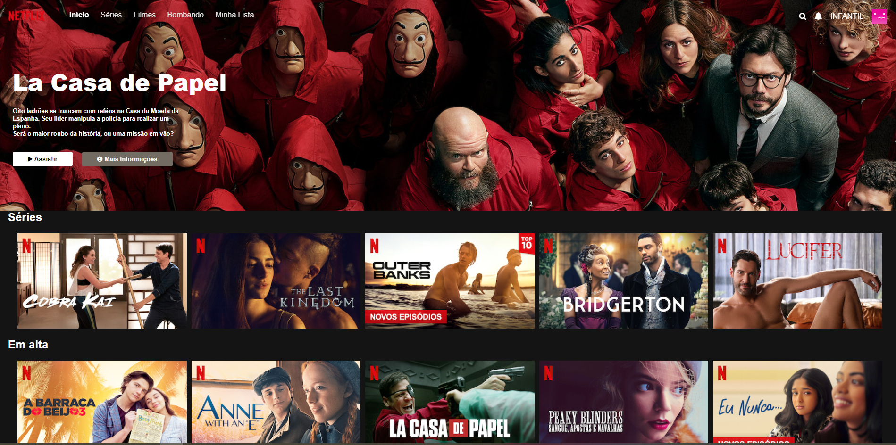

# Mestre dos códigos DB1 - Clone UI Netflix
- Participação do [programa Mestre dos Códigos da DB1](https://mestredoscodigos.com.br/) no nível escudeiro, sendo este o primeiro nível obrigatório.

## Sobre o desafio

Desenvolver uma landing page, baseada na página principal do Youtube Music e Netflix.

A página pode ser do tema que o candidato preferir, devendo apenas seguir e a mesma estrutura visual e contendo os itens apresentados nos requisitos a seguir.

- Os requisitos para este desafio pode ser encontrado na pagina oficial do [mestre dos códigos](https://https://db1group.github.io/mestre-dos-codigos/#/frontend)

## O que foi feito
Uma landing page baseada nas caracteristicas visuais da [Netflix](https://https://www.netflix.com/browse).

## Desenvolvimento
Esta landing page foi baseada apenas no uso de HTML, JS e CSS, como mencionado nos critérios do desafio nao sendo permitido nenhum uso de frameworks, pre-processadores ou quaisquer outras ferramentas de abstração.

## Estrutura do projeto
```
clone-netflix
| index.html
│ README.md
│ RESPOSTAS.md
| LICENSE
└─assets
│  └─images
│     │images.jpg
│     │ ...
└─src
  └─index.js
```
- O arquivo RESPOSTAS.md consiste no questionario exigido no [desafio](https://https://https://db1group.github.io/mestre-dos-codigos/#/frontend) que consiste em 21 perguntas sobre tecnologias front-end.

## Resultado
- [Acessar clone Netflix](https://mestre-codigo-db-1-clone-netflix.vercel.app/)
- UI Clone
  

## Tecnologias utilizadas

- [HTML](https://developer.mozilla.org/pt-BR/docs/Web/HTML)
- [CSS](https://developer.mozilla.org/pt-BR/docs/Web/CSS)
- [JavaScript](https://developer.mozilla.org/en-US/docs/Web/JavaScript)

## Desenvolvedor
- Nome: Lucas Farias
- E-mail: lucas.farias@db1.com.br
## Licença

- Este projeto está sob a licença [MIT](LICENSE).
